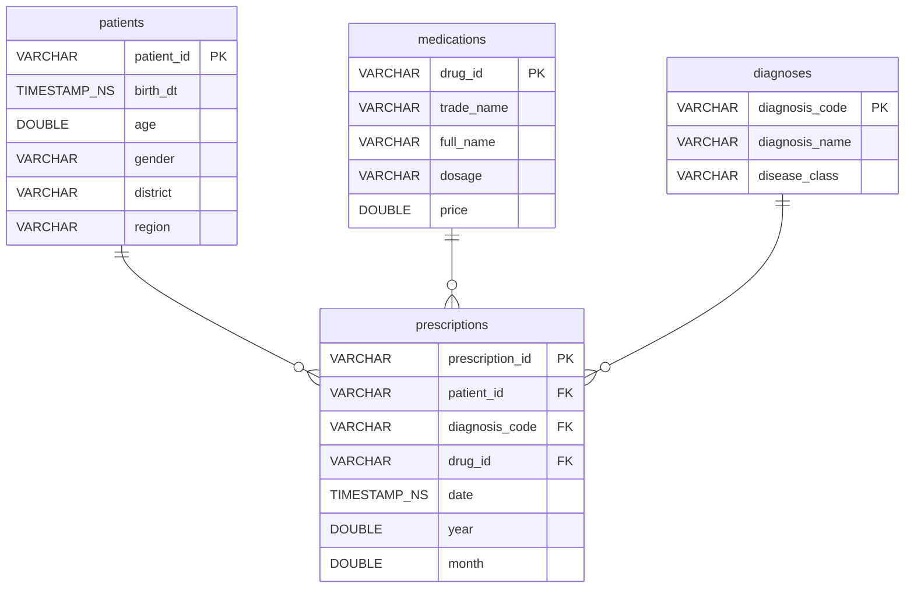

# Data Analysis

Exploratory data analysis and analytics modules for medical data.

## Dataset

Source: https://disk.yandex.ru/d/EYdH6iSdrrCCUQ

## Data Schema

## Structure

- `analyse/` - Analytics modules
- `notebooks/` - Jupyter notebooks for exploratory analysis
- `tests/` - Unit tests
